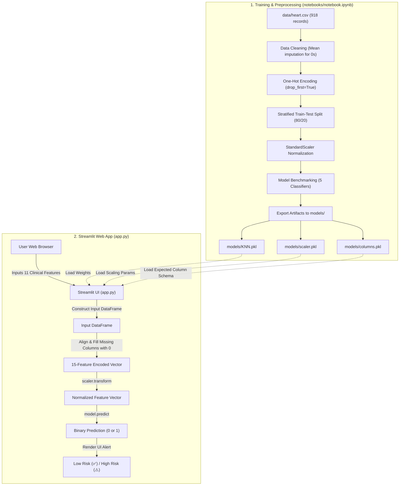

# Mini_ML02: Heart Disease & Stroke Risk Prediction Web Application

An interactive machine learning web application built with Streamlit and Scikit-learn to assess patient heart disease and stroke risk using clinical health indicators.

---

## Table of Contents

- [Overview](#overview)
- [Features](#features)
- [Architecture](#architecture)
- [Tech Stack](#tech-stack)
- [Model Performance & Benchmarks](#model-performance--benchmarks)
- [Dataset & Features](#dataset--features)
- [Prerequisites](#prerequisites)
- [Installation](#installation)
- [Configuration](#configuration)
- [Usage](#usage)
- [Project Structure](#project-structure)
- [Testing](#testing)
- [Contributing](#contributing)
- [License](#license)

---

## Overview

**Mini_ML02** provides an end-to-end machine learning solution for clinical heart disease risk evaluation. The project trains and compares multiple classification algorithms on 918 patient records, selecting a top-performing K-Nearest Neighbors (KNN) model (88.59% accuracy, 0.8986 F1 score). 

The trained model, standard feature scaler, and encoded feature schema are serialized and deployed via a lightweight, real-time Streamlit web interface (`app.py`), enabling clinicians and individuals to input diagnostic measurements and receive instant risk classifications.

---

## Features

- **Exploratory Data Analysis & Cleaning**: Handles missing/zero-value clinical anomalies in Resting Blood Pressure and Cholesterol by imputing non-zero feature means.
- **Categorical Feature Encoding**: Encodes non-numeric attributes (`Sex`, `ChestPainType`, `RestingECG`, `ExerciseAngina`, `ST_Slope`) via one-hot dummy encoding (`drop_first=True`).
- **Feature Normalization**: Fits a `StandardScaler` to scale continuous features (`Age`, `RestingBP`, `Cholesterol`, `MaxHR`, `Oldpeak`) to standard normal distributions.
- **Multi-Model Benchmarking**: Trains and evaluates 5 machine learning classifiers (Logistic Regression, KNN, Gaussian Naive Bayes, Decision Tree, Calibrated RBF Support Vector Machine).
- **Artifact Serialization**: Persists model weights (`KNN.pkl`), pre-fitted scaler (`scaler.pkl`), and expected input column order (`columns.pkl`) via `joblib`.
- **Interactive Web Interface**: Streamlit UI with input validation, numeric steppers, and sliders providing immediate risk alerts (`⚠️ High Risk of Heart Disease` vs. `✅ Low Risk of Heart Disease`).

---

## Architecture



---

## Tech Stack

| Component | Technology | Description |
|---|---|---|
| **Language** | Python 3.9+ | Application and pipeline runtime |
| **Web Interface** | Streamlit | Real-time interactive UI framework |
| **Machine Learning** | Scikit-learn | Classifier algorithms, metrics, and preprocessing (`StandardScaler`) |
| **Data Processing** | Pandas, NumPy | Data cleaning, one-hot encoding, and array transformations |
| **Model Persistence** | Joblib | Model and pipeline serialization (`.pkl`) |
| **Data Exploration** | Matplotlib, Seaborn | Distribution plots, heatmaps, and boxplots in Jupyter |
| **Environment** | Conda / Pip | Package and virtual environment management |

---

## Model Performance & Benchmarks

All models were evaluated in `notebooks/notebook.ipynb` using an 80/20 stratified train/test split (`random_state=42`, test set $n = 184$):

| Model | Accuracy | F1 Score | Status |
|---|---|---|---|
| **K-Nearest Neighbors (KNN)** | **88.59%** | **0.8986** | **Selected & Deployed** |
| Logistic Regression | 87.50% | 0.8878 | Evaluated |
| Gaussian Naive Bayes | 86.96% | 0.8788 | Evaluated |
| Support Vector Machine (RBF Kernel) | 86.41% | 0.8804 | Evaluated |
| Decision Tree | 75.54% | 0.7716 | Evaluated |

---

## Dataset & Features

The dataset (`data/heart.csv`) contains 918 observations across 11 clinical features and 1 binary target label (`HeartDisease`):

| Feature Name | Type | Unit / Categories | Description |
|---|---|---|---|
| `Age` | Numerical | Years (18–100) | Patient age |
| `Sex` | Categorical | `M`, `F` | Biological sex |
| `ChestPainType` | Categorical | `TA`, `ATA`, `NAP`, `ASY` | Typical Angina, Atypical Angina, Non-Anginal Pain, Asymptomatic |
| `RestingBP` | Numerical | mm Hg (80–200) | Resting blood pressure |
| `Cholesterol` | Numerical | mg/dL (100–600) | Serum cholesterol level |
| `FastingBS` | Binary | `0`, `1` | Fasting blood sugar > 120 mg/dL (1 = True, 0 = False) |
| `RestingECG` | Categorical | `Normal`, `ST`, `LVH` | Resting electrocardiogram results |
| `MaxHR` | Numerical | bpm (60–220) | Maximum heart rate achieved |
| `ExerciseAngina` | Categorical | `Y`, `N` | Exercise-induced angina |
| `Oldpeak` | Numerical | Depression (0.0–6.0) | ST depression induced by exercise relative to rest |
| `ST_Slope` | Categorical | `Up`, `Flat`, `Down` | Slope of the peak exercise ST segment |
| `HeartDisease` | Target (Binary) | `0`, `1` | Diagnosis of heart disease (1 = High Risk, 0 = Normal/Low Risk) |

---

## Prerequisites

- **Python**: Version 3.9 or higher (tested with Python 3.11 / 3.13)
- **Package Manager**: `pip` or `conda` / `mamba`

---

## Installation

1. **Clone the repository**:
   ```bash
   git clone https://github.com/Omiiii04/Mini_ML02.git
   cd Mini_ML02
   ```

2. **Create and activate a virtual environment**:

   *Using Conda:*
   ```bash
   conda create -n heart-ml python=3.11 -y
   conda activate heart-ml
   ```

   *Using Python venv:*
   ```bash
   python -m venv .venv
   ```
   - On Windows (PowerShell):
     ```powershell
     .venv\Scripts\Activate.ps1
     ```
   - On Linux / macOS:
     ```bash
     source .venv/bin/activate
     ```

3. **Install dependencies**:
   ```bash
   pip install -r requirements.txt
   ```

---

## Configuration

This project does not require external environment variables, cloud services, or database connections. All required model artifacts are loaded locally from the `models/` directory:

| Artifact Path | Description |
|---|---|
| `models/KNN.pkl` | Serialized `KNeighborsClassifier` model |
| `models/scaler.pkl` | Pre-fitted `StandardScaler` transformer |
| `models/columns.pkl` | Python list of 15 expected feature column names |

---

## Usage

### 1. Launch the Streamlit Web Application

Run the application locally:

```bash
streamlit run app.py
```

After starting, open your browser to the local URL displayed in your terminal (default: `http://localhost:8501`).

#### Inputting Data & Obtaining Predictions:
1. Adjust the sliders and dropdown menus for the 11 patient features.
2. Click **Predict**.
3. View the prediction output:
   - **`⚠️ High Risk of Heart Disease`**: Positive prediction (`1`).
   - **`✅ Low Risk of Heart Disease`**: Negative prediction (`0`).

### 2. Run the Jupyter Notebook (EDA & Retraining)

To inspect exploratory data analysis, run statistical distributions, or retrain models:

```bash
jupyter notebook notebooks/notebook.ipynb
```

---

## Project Structure

```text
Mini_ML02/
├── .vscode/
│   └── settings.json        # Python environment manager preferences
├── data/
│   └── heart.csv            # Clinical dataset (918 rows, 12 columns)
├── models/
│   ├── KNN.pkl              # Saved K-Nearest Neighbors model
│   ├── columns.pkl          # List of 15 one-hot encoded feature column names
│   └── scaler.pkl           # Saved StandardScaler fitted on training set
├── notebooks/
│   └── notebook.ipynb       # EDA, feature scaling, model benchmarking, and export notebook
├── .gitignore               # Ignored files, cache directories, and environments
├── app.py                   # Streamlit web application entry point
├── README.md                # Project documentation
└── requirements.txt         # Project dependencies
```

---

## Testing

The repository does not contain an automated test runner suite (e.g. `pytest`). 

To manually verify that model inference and artifact loading operate correctly, run the following verification snippet:

```bash
python -c "
from pathlib import Path
import joblib, pandas as pd

MODEL_DIR = Path('models')
model = joblib.load(MODEL_DIR / 'KNN.pkl')
scaler = joblib.load(MODEL_DIR / 'scaler.pkl')
cols = joblib.load(MODEL_DIR / 'columns.pkl')

sample = pd.DataFrame([{col: 0 for col in cols}])
scaled = scaler.transform(sample)
pred = model.predict(scaled)
print('Inference verification passed. Output:', pred[0])
"
```

---

## Contributing

1. Fork the repository: `https://github.com/Omiiii04/Mini_ML02`
2. Create a feature branch: `git checkout -b feature/your-feature-name`
3. Commit your changes: `git commit -m "Add feature description"`
4. Push to your branch: `git push origin feature/your-feature-name`
5. Open a Pull Request on GitHub.

---

## License

<!-- NEEDS INPUT: License file not found in repository. Please specify the project license (e.g., MIT, Apache 2.0). -->
